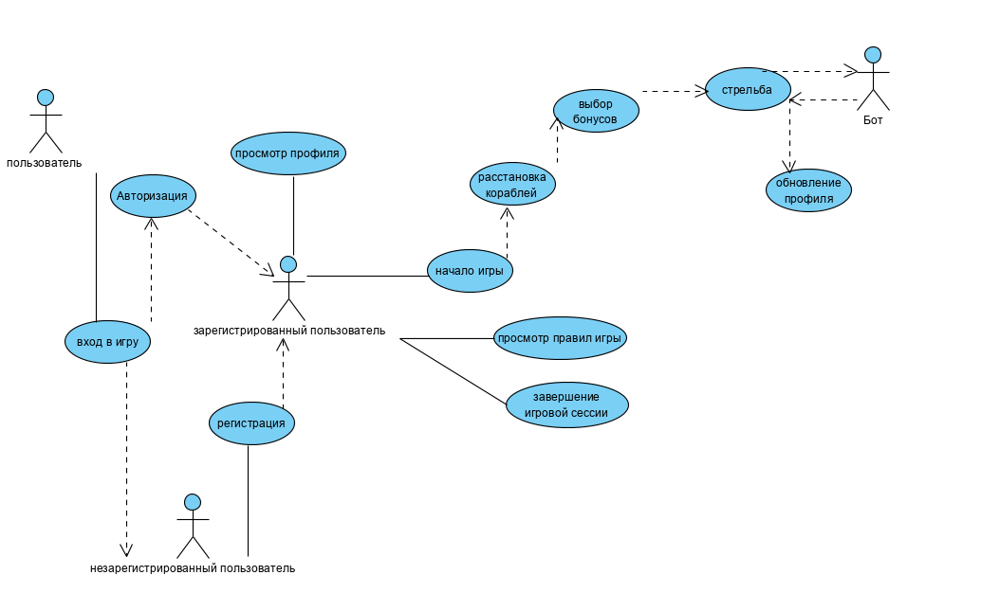

# UML Диаграммы
1. [Use Case](#1) 
1.1 [Актеры](#1.1) 
1.2 [Поток событий](#1.2) 
1.2.1 [Регистрация](#1.2.1) 
1.2.2 [Авторизация](#1.2.2) 
1.2.3 [Просмотр профиля](#1.2.3) 
1.2.4 [Расстановка кораблей](#1.2.4) 
1.2.5 [Выбор бонусов](#1.2.5) 
1.2.5 [Стрельба](#1.2.6) 
1. [Диаграмма активности](#2) 
2.1 [Регистрация](#2.1) 
2.2 [Проверка условия конца игры](#2.2) 
1. [Диаграмма полседовательности](#3)
2. [Диаграмма состояния](#4)
3. [Диаграмма классов](#5)
4. [Диграмма компонентов](#6)
5. [Диаграмма развертывания](#7)

### 1. Use Case диаграмма
Use Case диаграммы игры "Морской бой":

#### 1.1 Актеры
Aктеры | Описание
--- | ---
Незарегистрированный игрок|Пользователь, который зашел в игру без учетной записи.
Зарегистрированный игрок|Пользователь, который зашел в игры с учетной записи и может просматривать статистику.
Пользователь|Человек, пользующийся персональным компютером.

#### 1.2 Поток событий
##### 1.2.1 Регистрация
**Описание.** "Регистрация" предоставляет пользователю новые возможности, такие как хранение средств и достижений. 
Поток событий:
1. Нажатие кнопки регистрации в меню игры.
2. Пользователь вводит логин и пароль.
3. Игра проверяет уникальность данных.
4. Приложение добавляет нового пользователя в базу данных.
5. Конец.
##### 1.2.2 Авторизация
**Описание.** "Авторизация" позволяет пользователю войти в заранее созданный профиль.
Поток событий:
1. Пользователь вводит данные учетной записи в специально отведенный поля.
2. Пользователь нажимет на кнопку авторизации.
3. Приложение проверяет данные на валидность.
4. Если данные неправильные, то возвращаемся к 1 шагу.
5. После успешной авторизации игра переходит в главное меню.
6. Конец.
##### 1.2.3 Просмотр профиля
**Описание.**"Авторизованный игрок может имеет возможность просмотра своих средств и достижений.
Поток событий:
1. Пользователь нажимает на кнопку просмотря профиля.
1. Экран меняется на меню профиля.
2. Игрок просматривает свои данные.
3. Конец.
##### 1.2.4 Расстановка кораблей
**Описание.** Пользователю предоставляется возможность расстановки кораблей на игровом поле.
1. Игрок нажимает на кнопку "Начать игру".
2. Экран меняется на меню расстановки кораблей.
3. пользователь может расставить корабли по своему желанию.
4. Игрок нажимает на кнопку "Продолжить".
5. Игра переходит в следующию стадию.
6. Конец.
##### 1.2.5 Выбор бонусов 
**Описание.** Позволяет выбрать специальные механики для боя взамена на внутриигровую валюту. 
Поток событий:
1. Пользователь нажимает кнопку "продолжить" в меню расстоновки.
2. Текущий экран меняется на меню выбора бонусов.
3. Игрок может выбрать желаемые дополнения для игры.
4. Пользователь нажимает на кнопку "Начать бой".
5. Приложение переходит в стадию игры.
6. Конец.
##### 1.2.6 Стрельба 
**Описание.** Позволяет стрелять в корабли противника и. 
Поток событий:
1. Игрое нажимает на пустую клетку на вражеском поле.
2. Приложение проверяет есть ли там корабль противника.
3. Игры помечает клетку в зависимости от условия попадания.
4. Если Пользватель попал во вражеский корабль, то возвращаемся в шагу 1.
5. Бот делает такие же действия как и игрок.
6. Игра заканчивается, если  хоть у одной из сторон закончились корабли.
7. Экран меняется на меню победы/поражения в зависимости от условия.
8. Конец.
### 2. Диаграмма активности
##### 2.1 Регистрация 
Когда пользователь вводит корректные данные для регистрации, приложение создает новую учетную запись. Если данные неверные - пользователь информируется об ошибке.

##### 2.2 Проверка условия конца игры 
На каждом шагу игра проверяет наличие кораблей у всех игроков.

### 3. Диаграмма последовательности
Диаграмма последовательности приложения:

### 4. Диаграмма состояний
Диаграмма состояний описывает поведение ячейки игрового поля во время всего игрового процесса.

### 5. Диаграмма классов
Диаграмма классов показывает как разработана система и взаимодействие частей системы во время разработки.

### 6. Диаграмма компонентов
Диаграмма компонентов описывает как компоненты соединены и как данные перемещаются внутри приложения. Игра морской бой разработана по MVC архитектуре. 

### 7. Диаграмма развертывания

