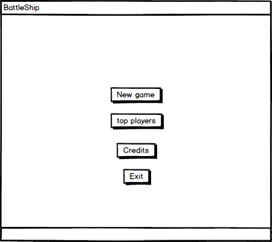
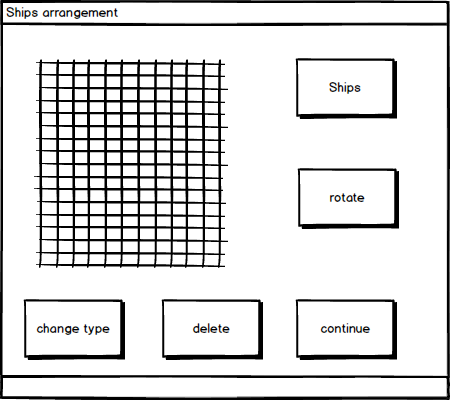
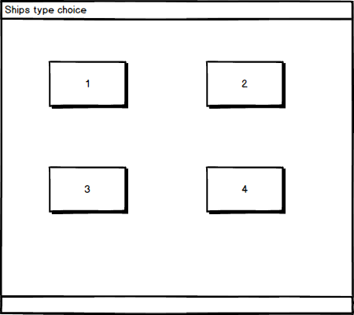

# Требования к проекту
---

# Содержание
1 [Введение](#intro)  
1.1 [Назначение](#appointment)  
1.2 [Бизнес-требования](#business_requirements)  
1.3 [Аналоги](#analogues)  
2 [Требования пользователя](#user_requirements)  
2.1 [Программные интерфейсы](#software_interfaces)  
2.2 [Интерфейс пользователя](#user_interface)  
2.3 [Характеристики пользователей](#user_specifications)  
2.3.1 [Аудитория приложения](#user_classes)  
3 [Системные требования](#system_requirements) 
3.1 [Нефункциональные требования](#non-functional_requirements)  
3.1.1 [Атрибуты качества](#non-functional_requirements)  
3.1.1.1 [Требования к удобству использования](#requirements_for_ease_of_use) 
3.1.1.2 [Требования к безопасности](#security_requirements) 
3.2 [Функциональные требования](#functional_requirements) 
3.2.1 [Основные функции](#main_functions) 
3.2.1.1 [Вход пользователя в приложение](#user_logon_to_the_application) 
3.2.1.2 [Загрузка данных](#download_data) 
3.2.1.3 [Автоматическая расстановка](#add_new_car) 
3.2.1.3 [Поворот корабля](#add_new_car) 
4 [Описание игры](#game_description) 
4.1 [Цель игры](#game_purpose)  
4.2 [Правила](#rules)  

<a name="G"/>

# Глоссарий
| Термин | Описание | 
|:---|:---|
| [радар](#game_description) | позволяет игроку посмотреть рапсоложение вражеских кораблей в ограниченном радиусе.|
| [артиллерия](#game_description) | позволяет за 1 ход выстрелить в несколько точек|
| [скрытие от радара](#game_description) | возможность скрыть определенный корабль от вражеского радара|
|[линкор](@rules)|четырёхпалубный корабль|
|[крейсера](@rules)|трёхпалубный корабль|
|[эсминцы](@rules)|двухпалубный корабль|
|[торпедные катера](@rules)|однопалубный корабль|
|[buy-to-play](@bs_)|Игра требующая внесения денежных средств для игры|

Размещаются: 1 корабль — ряд из 4 клеток (линкор) 2 корабля — ряд из 3 клеток (крейсера) 3 корабля — ряд из 2 клеток (эсминцы) 4 корабля — 1 клетка (торпедные катера)
<a name="intro"/>

## 1 Введение
Проект представляет из себя аналог классической игры "Морской бой". Даннае игра является настольным приложением, которое поддерживает режим игры с ботом, а также имеет различные режимы сложности и возможность расширения игровых механик.

<a name="appointment"/>

## 1.1 Назначение
Этот документ является основным источником с требованиями к игре «battleship» для ОС Windows. 

<a name="business_requirements"/>

## 1.2 Бизнес-требования

<a name="project_boundary"/>

### 1.2.1 Границы проекта
Приложение "battleship" позволит пользователям играть в классическую игру "морской бой" с возможностью сохранения результатов и быстрой расстановки.

<a name="analogues"/>

## 1.3 Аналоги

<a name="bs_"/>

## Battleship

**Русский интерфейс:**  Нет 

**Модель распространения:** buy-to-play

#### Особенности:
   * 3D графика
   * Казуальность 
   * Различные модификации
   
<a name="user_requirements"/>

# 2 Требования пользователя

<a name="software_interfaces"/>

## 2.1 Программные интерфейсы
Игра начинается после расстановки кораблей. Нужно нажимать на вражеское поле и приложение будет обрабатывать нажатия.

<a name="user_interface"/>

## 2.2 Интерфейс пользователя
Окно входа в приложение.

 

Окно расстановки кораблей.

Окно выбора типа корабля.

<a name="user_specifications"/>

## 2.3 Характеристики пользователей

<a name="user_classes"/>

### 2.3.1 Аудитория приложения
Люди любой возрастной категории, умеющие пользоваться ПК.

<a name="system_requirements"/>

# 3 Системные требования

<a name="non-functional_requirements"/>

## 3.1 Нефункциональные требования

<a name="quality_attributes"/>

### 3.1.1 Атрибуты качества

<a name="requirements_for_ease_of_use"/>

#### 3.1.1.1 Требования к удобству использования
1. Интуитивно понятный интерфейс;
2. Обратная связь с пользователем;

<a name="security_requirements"/>

#### 3.1.1.2 Требования к безопасности
Приложение предоставляет возможность просмотра и редактирования профиля только активного пользователя.

<a name="functional_requirements"/>

## 3.2 Функциональные требования

<a name="main_functions"/>

### 3.2.1 Основные функции

<a name="user_logon_to_the_application"/>

#### 3.2.1.1 Вход пользователя в приложение
**Описание.** Пользователь имеет возможность использовать приложение без создания собственного профиля.

| Функция | Требования | 
|:---|:---|
| Вход в приложение без создания собственного профиля | Приложение должно предоставить пользователю полный функционал приложения|

<a name="download_data"/>

#### 3.2.1.2 Загрузка данных
**Описание.** После входа пользователя в приложение необходимо загрузить информацию о очках пользователя.

| Функция | Требования | 
|:---|:---|
| Загрузка информации о очках| Приложение должно загрузить информацию о очках после входа пользователя в приложение |

<a name="automatic_placement"/>

#### 3.2.1.3 Автоматическая расстановка
**Описание.** После входа в меню расстановки, можно автоматически расставить корабли.

| Функция | Требования | 
|:---|:---|
| Автоматическая расстановка | Приложение должно автоматически расставить корабли всех типов на игровое поле|

<a name="automatic_placement"/>

#### 3.2.1.4 Поворт корабля 
**Описание.** Если корабли размещаются в ручном режиме, то предусмотрена возможность поворота кораблей.

| Функция | Требования | 
|:---|:---|
| Поворот корабля | Приложение должно повернуть корабль на 90 градусов при нажатии на кнопку поворота |
<a name="add_new_car"/>
<a name="functional_requirements"/>

#### 3.2.1.5 Добавление нового пользователя
| Требование | Описание | 
|:---|:---|
|Добавление новой учетной записи|Приложение должно иметь возможность добавления новой учетной записи|
<a name="game_description"/>

# 4 Описание игры
Игра предназначена для 1 игрока.Он должен расставить свои корабли на поле и начать искать вражеские. У пользователя есть несколько 
дополнительных возможностей(радар, артиллерия, скрытие от радара ).

<a name="game_purpose"/>

## 4.1 Цель игры
Целью игры - уничтожить корабли противника раньше, чем он ваши.
<a name="rules"/>

## 4.2 Правила
Игровое поле —  квадрат 10×10 у каждого игрока, на котором размещается флот кораблей. Вертикали обычно нумеруются сверху вниз, а горизонтали помечаются буквами слева направо.
Размещаются:
  1 корабль — ряд из 4 клеток («четырёхпалубный»; линкор)
  2 корабля — ряд из 3 клеток («трёхпалубные»; крейсера)
  3 корабля — ряд из 2 клеток («двухпалубные»; эсминцы)
  4 корабля — 1 клетка («однопалубные»; торпедные катера)

При размещении корабли не могут касаться друг друга сторонами и углами.

Рядом со «своим» полем размещается «чужое» такого же размера, только пустое. Это участок моря, где плавают корабли противника.

При попадании в корабль противника — на чужом поле ставится крестик, при холостом выстреле — точка. Попавший стреляет ещё раз.

