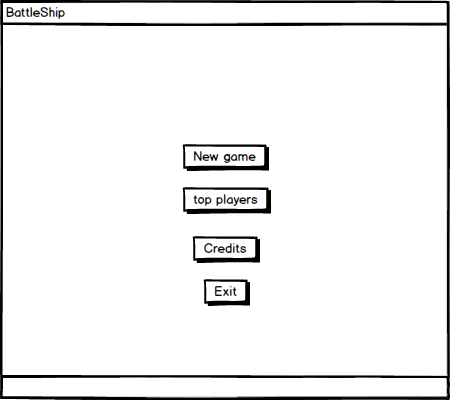
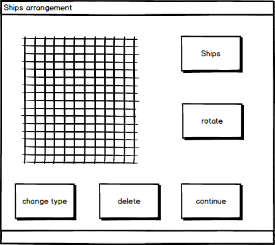

# Требования к проекту
---

# Содержание
1 [Введение](#intro)  
1.1 [Назначение](#appointment)  
1.2 [Бизнес-требования](#business_requirements)  
1.2.1 [Исходные данные](#initial_data)  
1.3 [Аналоги](#analogues)  
2 [Требования пользователя](#user_requirements)  
2.1 [Программные интерфейсы](#software_interfaces)  
2.2 [Интерфейс пользователя](#user_interface)  
2.3 [Характеристики пользователей](#user_specifications)  
2.3.1 [Аудитория приложения](#application_audience)  
3 [Системные требования](#system_requirements) 
3.1 [Нефункциональные требования](#non-functional_requirements)  
3.1.1 [Атрибуты качества](#non-functional_requirements)  
3.1.1.1 [Требования к удобству использования](#requirements_for_ease_of_use) 
3.1.1.2 [Требования к безопасности](#security_requirements) 
3.2 [Функциональные требования](#functional_requirements) 
3.2.1 [Основные функции](#main_functions) 
3.2.1.1 [Вход пользователя в приложение](#user_logon_to_the_application) 
3.2.1.2 [Загрузка данных](#download_data) 
3.2.1.3 [Добавление нового автомобиля](#add_new_car) 

<a name="intro"/>

# 1 Введение
Даннае игра является настольным приложением, которое поддерживает режим игры с компьютером. Имеет различные режимы сложности и возможность расширения игровых механик.

<a name="appointment"/>

## 1.1 Назначение
Этот документ является основным источником с требованиями к игре «battleship» для ОС Windows. 

<a name="business_requirements"/>

## 1.2 Бизнес-требования

<a name="initial_data"/>

### 1.2.1 Исходные данные
Большинство людей имеют свободное время, которое они хотели потратить на развлечения. Для этого и существуют игры. Основное назначение логической игры «Морской бой» - развитие логического мышления и параллельное развлечение; в связи с потенциальной возможностью сохранения результатов игр, возможен также соревновательный игровой процесс; построение стратегий.

<a name="project_boundary"/>

### 1.2.2 Границы проекта
Приложение "battleship" позволит пользователям играть в классическую игру "морской бой" с возможностью сохранения результатов и быстрой расстановки.

<a name="analogues"/>

## 1.3 Аналоги

<a name="bs_"/>

## Battleship

**Русский интерфейс:**  Нет 

**Цена:** платная

#### Особенности:
   * 3D графика
   * Казуальность 
   * Различные модификации
   
<a name="user_requirements"/>

# 2 Требования пользователя

<a name="software_interfaces"/>

## 2.1 Программные интерфейсы
Игра начинается после расстановки кораблей. Нужно нажимать на вражеское поле и приложение будет обрабатывать нажатия.

<a name="user_interface"/>

## 2.2 Интерфейс пользователя
Окно входа в приложение.

 

Окно расстановки кораблей.

 

<a name="user_specifications"/>

## 2.3 Характеристики пользователей

<a name="user_classes"/>

### 2.3.1 Аудитория приложения
Люди любой возрастной категории, умеющие пользоваться ПК.

<a name="system_requirements"/>

# 3 Системные требования

<a name="non-functional_requirements"/>

## 3.1 Нефункциональные требования

<a name="quality_attributes"/>

### 3.1.1 Атрибуты качества

<a name="requirements_for_ease_of_use"/>

#### 3.1.1.1 Требования к удобству использования
1. Возможность автоматической расстановки;
2. Интуитивно понятный интерфейс;
3. Обратная связь с пользователем;

<a name="security_requirements"/>

#### 3.1.1.2 Требования к безопасности
Приложение предоставляет возможность просмотра и редактирования профиля только активного пользователя.

<a name="functional_requirements"/>

## 3.2 Функциональные требования

<a name="main_functions"/>

### 3.2.1 Основные функции

<a name="user_logon_to_the_application"/>

#### 3.2.1.1 Вход пользователя в приложение
**Описание.** Пользователь имеет возможность использовать приложение без создания собственного профиля.

| Функция | Требования | 
|:---|:---|
| Вход в приложение без создания собственного профиля | Приложение должно предоставить пользователю полный функционал приложения|

<a name="download_data"/>

#### 3.2.1.2 Загрузка данных
**Описание.** После входа пользователя в приложение необходимо загрузить информацию о очках пользователя.

| Функция | Требования | 
|:---|:---|
| Загрузка информации о очках| Приложение должно загрузить информацию о очках после входа пользователя в приложение |

<a name="add_new_car"/>

#### 3.2.1.3 Добавление нового пользователя
**Описание.** Возможность добавления новой учетной записи.

**Требование.** Приложение должно предоставить пользователю возможность добавления учетной записи. \\\\
